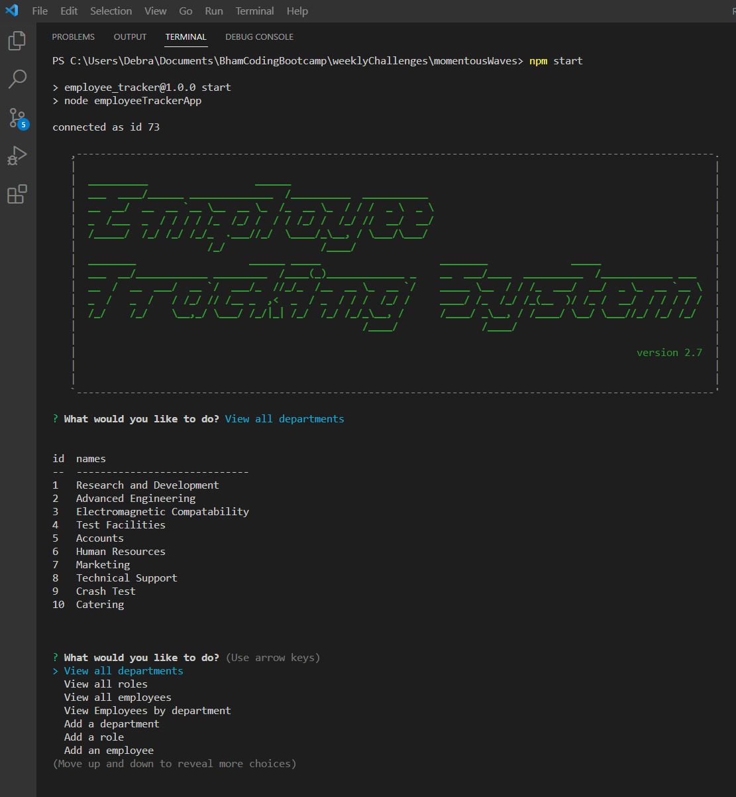
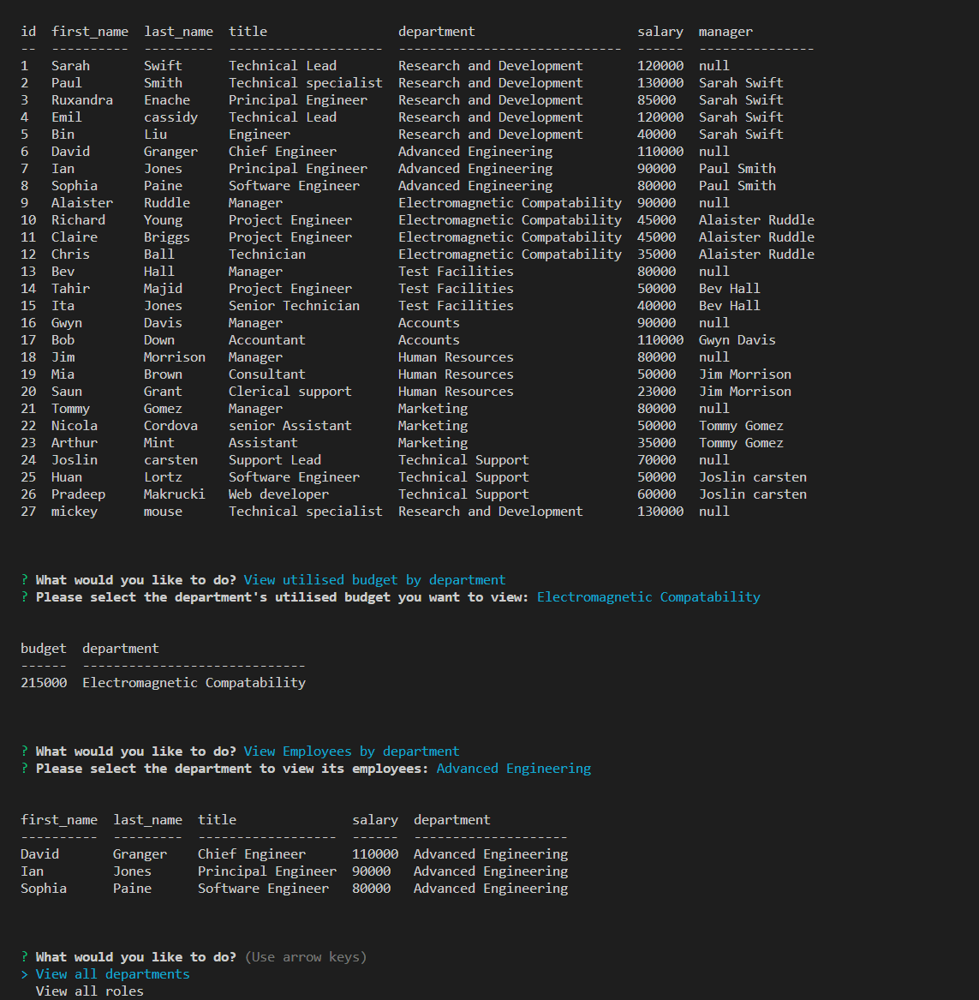

# Employee TRacker [](https://opensource.org/licenses/MIT)  
  
  ## Table of Contents  
  * [Description](#description)
  * [Installation](#installation)
  * [Usage](#usage)
  * [Walk Through Video](#walk-through-video)
  * [Screen Shots](#screen-shots)
  * [Tests](#tests)
  * [Technologies Used](#technologies-used)  
  * [Questions](#questions)
  * [How to Contribute](#How-to-Contribute)   
  * [License](#license)
  
  ## Description

  The motivation behind this project is to create an application that allows non-devlopers to eaily view and interact with information stored in a database.  The application is 
  The main development aim of this project was to build a command-line application that can be used to manage a company's employee database using Node.j, Inquirer and MySQL.

    
  ### Functional Requirements

  The functional requirements that the Employee TRacker application has been designed to meet are defined by the user story and acceptance criteria listed below.  

  #### User Story

  ```md
AS A business owner
I WANT to be able to view and manage the departments, roles, and employees in my company
SO THAT I can organize and plan my business
```

 

#### Acceptance Criteria

```md
GIVEN a command-line application that accepts user input
WHEN I start the application
THEN I am presented with the following options: view all departments, view all roles, view all employees, add a department, add a role, add an employee, and update an employee role
WHEN I choose to view all departments
THEN I am presented with a formatted table showing department names and department ids
WHEN I choose to view all roles
THEN I am presented with the job title, role id, the department that role belongs to, and the salary for that role
WHEN I choose to view all employees
THEN I am presented with a formatted table showing employee data, including employee ids, first names, last names, job titles, departments, salaries, and managers that the employees report to
WHEN I choose to add a department
THEN I am prompted to enter the name of the department and that department is added to the database
WHEN I choose to add a role
THEN I am prompted to enter the name, salary, and department for the role and that role is added to the database
WHEN I choose to add an employee
THEN I am prompted to enter the employee’s first name, last name, role, and manager, and that employee is added to the database
WHEN I choose to update an employee role
THEN I am prompted to select an employee to update and their new role and this information is updated in the database 
```


  ## Installation
  
    - Install dependancies: npm i
    - Login to MySQL: 
       - run: db/source schema.sql
       - run: db/source seeds.sql

  ## Usage
  
  The Employee Tracker Application can be started by entering ```npm start ``` or ```node employeeTracker.js``` at the terminal command-line prompt.

  - You will then be presented with the main menu which gives you the option to select:  View departments, View roles, View all Employees, View employees by department, Add a department, Add a role, Add an Employee,
    Update an employee role, View utilised budget by department or End the session.
  - If you select 'view all departments', this option will display a table listing all departments names and department IDs.
  - If you select 'View roles', this option will display  a table listing all roles IDs and titles, the salary for the role and the department ID the role belongs to.
  - If you select 'view all employees', this option will display a table listing all employees by id, first name, last name, title, department name, salary and their managers name. Null mamanger entries indicate that that employee does nothave a manager.
  - If you select 'View employees by department' you will be further prompted to select the department you want to view the employees for.  This will then display a table showing first, name, title of role, salary and department name.
  - If you select 'Add a department' you will be asked to enter the name of the department you wish to add to the database. After entering the new department name you will receive a message indicating that it has been successfully added the database.
  - If you select Add a role,you will receive further prompts to:
    - enter the title of the role
    - enter the salary of the role
    - select the name of the department the role belongs to 
  - If you select 'Add an employee' you will receive the following prompts to:
    - enter the employee's first name
    - enter the employee's last name
    - Select the employee's job title
    - Select the employee's manager.  If the employee does not have a manger enter slect 'none'
  - If you select 'Update an employee role' you will receive the following prompts to:
   - select the employee's role you wan tto update
   - Select the new role you want to assign to the employee
  - If you select view a 'departments utilised budget you will be asked to select the department - a table listing department name and utilised budget will be displayed.
  - After you have finished managing the employee database, select 'end session' to close the database connection. 


  ## Walk Through Video

   A  walk-through video demonstrating the functionality of the Employee Tracker Application is shown below:

   - [Employee Tracker walk-through video](https://watch.screencastify.com/v/ZZcYv8i3gv1w52DnPjB3)

   

  ## Screen Shots

  The following screen shot shows the server connection message and main menu.

  


  The following screen shot below displays the employees, deperatment utlised budget and employees by selected department tables.

  
  


  ## Tests
  No tests have been implemented.

  ## Technologies Used
  - JavaScript
  - Node Js
  - MySQL
  - Inquirer
  
    
 
  ## Questions
  If you have any questions regarding this project or contents of this repository, please contact me via:
  
  - email: dat826@gmail.com
  - GitHub: [Beanalini](https://github.com/Beanalini)  


  
  ## Contributing
  If you would like to contribute to this project you can contact me by email at dat826@gmail.com or through  GitHub account   @[Beanalini](https://github.com/Beanalini).
  

  ## License
  This project is covered under the MIT License  
  
  [](https://opensource.org/licenses/MIT) 
  